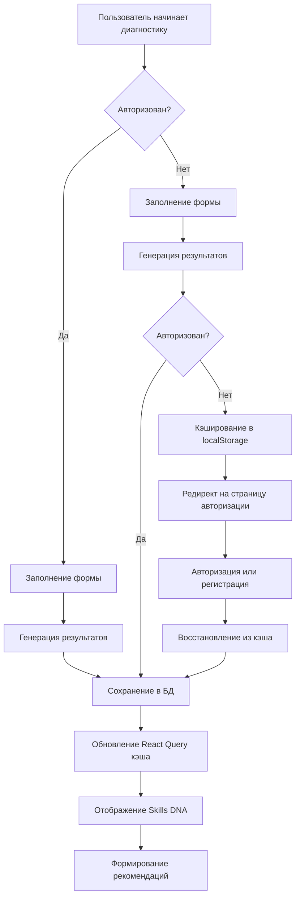

# Диагностика навыков: процесс и кэширование

## Обзор процесса

Диагностика навыков в NovaAI University позволяет создать профиль компетенций пользователя (Skills DNA). Система поддерживает два сценария прохождения диагностики:

1. **Авторизованный пользователь**: результаты сразу сохраняются в профиле
2. **Неавторизованный пользователь**: результаты кэшируются локально и восстанавливаются после авторизации

## Схема процесса диагностики



## Механизм кэширования

### Формат кэшированных данных

```json
{
  "timestamp": "2025-05-09T14:45:30.476Z",
  "results": {
    "userId": null,
    "skills": {
      "Программирование AI": 45,
      "Машинное обучение": 78,
      "Работа с данными": 65,
      "Нейросети": 59
    },
    "diagnosticType": "quick",
    "metadata": {
      "specialization": "machine-learning",
      "experience": "intermediate",
      "goal": "career",
      "languages": ["python", "javascript"]
    }
  },
  "cachingReason": "pending_auth",
  "cached": true
}
```

### Ключи локального хранилища

- `skillsDnaCachedResults`: основной кэш диагностики (localStorage)
- `diagnosticResults`: устаревший кэш (sessionStorage, для обратной совместимости)

## Обработка ошибок и восстановление

### Коды ошибок API

| Код | Описание | Действие системы |
|-----|----------|------------------|
| 401 | Не авторизован | Кэширует результаты, редирект на авторизацию |
| 403 | Нет доступа | Показывает сообщение об ошибке |
| 400 | Неверные данные | Показывает детали ошибки |
| 500 | Ошибка сервера | Пытается повторить запрос |

### Восстановление сессии

При успешной авторизации система:

1. Проверяет наличие кэшированных результатов (`localStorage.getItem('skillsDnaCachedResults')`)
2. Добавляет ID пользователя к результатам
3. Отправляет данные на сервер (`/api/diagnosis/results`)
4. После успешного сохранения очищает кэш
5. Инвалидирует кэш React Query для обновления UI

## Мониторинг

### События для аналитики

| Событие | Описание | Данные |
|---------|----------|--------|
| `diagnosis_started` | Пользователь начал диагностику | `{ diagnosticType: 'quick' \| 'deep' }` |
| `diagnosis_completed` | Диагностика завершена | `{ skillCount: number }` |
| `diagnosis_cached` | Результаты кэшированы | `{ reason: string }` |
| `diagnosis_recovered` | Результаты восстановлены | `{ timestamp: string, ageMs: number }` |
| `diagnosis_lost_session` | Сессия потеряна | `{ status: number, error: string }` |

### Алерты

Система настроена на отправку алертов в Slack при:
- Появлении событий `diagnosis_lost_session`
- Снижении конверсии из диагностики в Skills DNA ниже 90%

## Тестирование

### API тесты

```
node test-diagnosis-cache.js
```

### E2E тесты

```
pnpm cypress:run --spec cypress/e2e/diagnosis-flow.cy.ts
```

## Дополнительная информация

- Для доступа к API необходим валидный API ключ - передается в `X-API-KEY` заголовке
- Запросы API throttling: максимум 10 запросов в минуту для сохранения результатов
- Данные кэша хранятся до 7 дней и автоматически очищаются при успешном сохранении